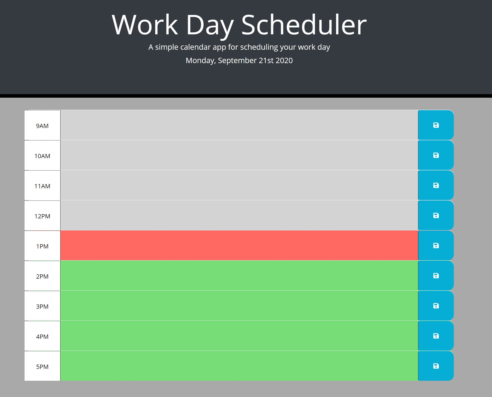

# Homework05 Third-Party APIs: Work Day Scheduler
This project is about the creation of a workday calendar that permits the user to save events for each work hour in the day. Saving the data entered by the user in the local storage, allowing the user to close or refresh the page and don't lose the data.

With the use of JQuery I've been able to manipulate all the elements and add CSS styling to them. Also, a library [Moment.js](https://momentjs.com/) has been used to be able to work with date and time used in this project. 

[Click here to Work Day Scheduler](https://chernanma.github.io/Homework05/Develop/)



---

## Instructions to save an event or task

- To Save an event or task click on the event area.
- Enter the event or task description.
- Click the Save button to save the information entered.
---
## Code Used

``` JS
/**** script.js******/

$("#currentDay").text(moment().format('dddd, MMMM Do YYYY'));

var currentTime = moment().hour();
// var currentTime = 13;

$(document).ready(function(){

    getDataLocalStorage(); //Calling function to load data form local storage
    updateTextAreaColor(); //Calling function to change text area color base on criteria 
   
    // Saving event into localstorage when click on Save
    $(".btn").on("click",function(){
        // Getting value from description text area for each time block
        var inputData = $(this).siblings(".description").val();  
        // Getting hour value from each time block by id
        var inputTime = $(this).parents(".time-block").attr("id").split("-")[1];
        //Saving the data in the local storage
        localStorage.setItem(inputTime,inputData);   
    });


});


//FUNCTION TO CHANGE TEXT AREA COLOR BASE ON CRITERIA
function updateTextAreaColor (){
    $(".time-block").each(function(){
        // Getting hour value from each time block by id
        var numtextArea = $(this).attr("id").split("-")[1];

        // Adding CSS to text area base on criteria 
        if ((parseInt(numtextArea)) === currentTime ) {
            $(this).addClass("present");
        } else if ((parseInt(numtextArea)) < currentTime) {
            $(this).addClass("past");
        } else {
            $(this).addClass("future");
        }      
        
    });    
}
//FUNCTION TO LOAD ALL THE DATA FROM LOCAL STORAGE
function getDataLocalStorage (){
    $(".time-block").each(function(){
         // Getting hour value from each time block by id
        var numtextArea = $(this).attr("id").split("-")[1];
         // Getting date from local storage for each text area
        var getData = localStorage.getItem(numtextArea);
        console.log(numtextArea,getData);
        // Inserting data into the text area for each element. 
        $(this).children(".description").val(getData);
    });
    
}

```
---
## Screenshots

### Text Area Colors
- Gray for past events
- Orange for current events
- Green for future events


### Save Button


---
## References

- Bootstrap, https://getbootstrap.com/

- Moment.js, https://momentjs.com/